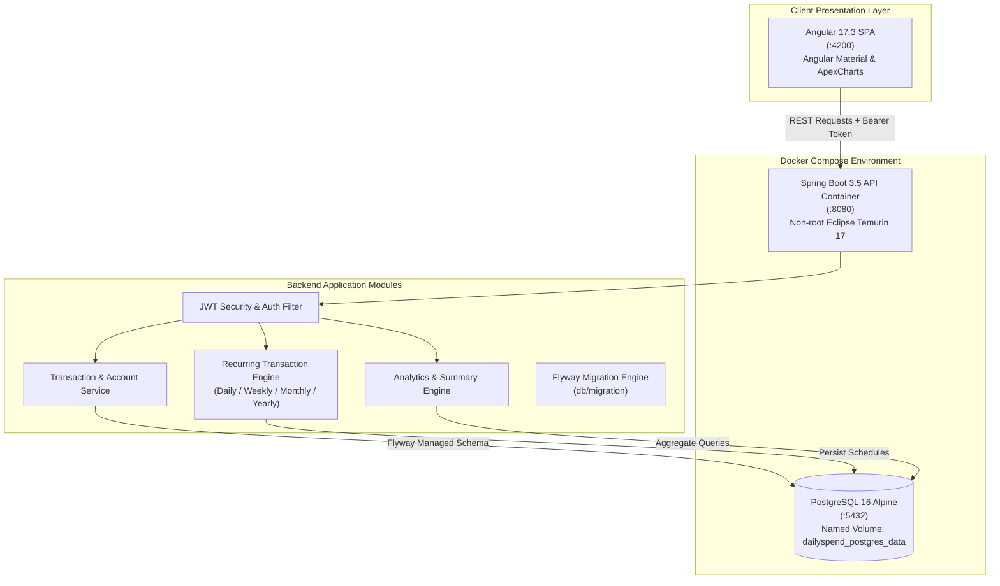

# 💸 DailySpend v2 — Containerized Personal Finance Platform

<p align="center">
  <a href="https://adoptium.net/"></a>
  <a href="https://spring.io/projects/spring-boot"></a>
  <a href="https://angular.dev/"></a>
  <a href="https://www.postgresql.org/"></a>
  <a href="https://www.docker.com/"></a>
  <a href="LICENSE"></a>
  <a href="#-quickstart--docker-deployment"></a>
</p>

<p align="center">
  Next-generation full-stack personal finance platform with Docker containerization, recurring transaction automation, peer debt ledgers, and visual financial analytics.
</p>

---

> [!NOTE]
> **Evolutionary Project: Built on DailySpend v1**
> This repository is **DailySpend v2**, building directly upon the foundation of **[DailySpend v1](https://github.com/tanmayythakare/dailySpend)**.
> **Key Upgrades in v2**:
> - 🐳 **1-Command Docker Compose**: Containerized PostgreSQL 16 + multi-stage Spring Boot backend with healthchecks.
> - 🔁 **Recurring Transactions Engine**: Automated scheduling for daily, weekly, monthly, and yearly recurring expenses.
> - 📊 **Deep Analytics Module**: Date-range aggregates, category breakdown summaries, and UPI payment payload helpers.
> - 👤 **User Profiles & Batch Processing**: Support for user profiles and batch transaction entries.

---

## 📸 Visual Showcase

| Dashboard & Accounts | Transactions & Ledger |
| :---: | :---: |
|  |  |
| **People Ledger (Debts & Loans)** | **Reports & Expense Breakdowns** |
|  |  |

> [!TIP]
> **Asset Storage**: System UI captures are organized under [`docs/Screenshots/`](docs/Screenshots/). Dropping new page screenshots into this directory will link directly into the showcase table.

---

## 🏛️ System Architecture



---

## 📖 What is DailySpend v2?

**DailySpend v2** is a personal finance ecosystem built for developers and users who want reliable, containerized financial management. It eliminates the manual burden of recalculating loans, splitting group tabs, and manually entering recurring bills every month.

### Key Problem It Solves:
1. **Recurring Bill Fatigue**: Automatically handles recurring rent, subscriptions, and utility bills.
2. **Peer Debts & Group Transparency**: Real-time peer balance tracking so you know exactly who owes whom across multiple shared expenses.
3. **Frictionless Local Execution**: No need to install and configure PostgreSQL or Java dependencies manually — Docker Compose spins up the entire backend and database stack in seconds.

---

## ✨ Features

- 🐳 **Containerized Architecture** — Complete Docker Compose orchestration with PostgreSQL healthchecks and multi-stage backend builds.
- 🔁 **Recurring Transactions Engine** — Configure automated recurring expenses with customizable recurrence cadences (`DAILY`, `WEEKLY`, `MONTHLY`, `YEARLY`).
- 👥 **People & Peer Ledger** — Calculate exact net balances per contact (credits vs debits).
- 🏦 **Multi-Account Management** — Seamlessly track multiple financial accounts (Cash, Bank accounts, Credit cards).
- 📊 **Advanced Analytics & Charts** — Visual trends, category distributions, and date-range metrics powered by ApexCharts.
- 💳 **Transaction Classification** — Support for Expenses, Income, Money Given (loans), and Money Taken (borrowing).
- 📲 **UPI Integration Ready** — Dedicated DTOs and configuration limits for UPI payment QR payload generation.
- 🔐 **Stateless Security** — JWT authentication with BCrypt password hashing and per-user data isolation.
- 📥 **CSV Export** — One-click transaction export for tax and accounting preparation.

---

## 🛠️ Tech Stack

### Backend & Containers
| Technology | Version | Purpose |
| :--- | :--- | :--- |
| **Java** | 17 LTS | Programming language |
| **Spring Boot** | 3.5.x | Application framework & REST controllers |
| **Docker & Docker Compose** | 3.9 spec | Multi-container application orchestration |
| **PostgreSQL** | 16 Alpine | Primary relational datastore with container healthchecks |
| **Spring Security** | 6.x | Stateless JWT security & authorization filters |
| **Spring Data JPA** | 3.x | Hibernate ORM with query specifications |
| **Flyway** | 10.x | Version-controlled immutable database migrations |
| **Eclipse Temurin** | 17 JRE | Secure, minimal non-root container base image |

### Frontend
| Technology | Version | Purpose |
| :--- | :--- | :--- |
| **Angular** | 17.3 | Single Page Application framework |
| **TypeScript** | 5.4 | Type-safe development |
| **Angular Material** | 17.3 | Material Design UI components |
| **ApexCharts** | 3.44 | Interactive data visualizations & dashboards |
| **SCSS** | — | Structured responsive styling |

---

## 🚀 Quickstart & Docker Deployment

### 1. Clone the Repository
```bash
git clone https://github.com/tanmayythakare/dailySpend2.git
cd dailySpend2
```

### 2. Configure Environment Variables
Copy the provided `.env.example` template:
```bash
cp .env.example .env
```

Verify or adjust environment values in `.env`:
```env
DATABASE_USERNAME=postgres
DATABASE_PASSWORD=postgres
JWT_SECRET=your_super_secret_key_at_least_32_characters_long
JWT_EXPIRATION=864000000
```

### 3. Spin Up Backend & Database via Docker
Run Docker Compose in detached mode:
```bash
docker compose up -d
```
Docker will:
1. Pull and start `postgres:16-alpine`.
2. Wait for PostgreSQL healthcheck to pass (`pg_isready`).
3. Build the Spring Boot container via multi-stage Dockerfile and launch the API on **http://localhost:8080**.

To check container status:
```bash
docker compose ps
docker compose logs -f backend
```

### 4. Start the Frontend
In a separate terminal, start the Angular development server:
```bash
cd dailyspend-frontend
npm install
npm start
```
Access the application at **http://localhost:4200**.

---

### Alternative: Bare-Metal Local Development (Without Docker)

If you prefer running services directly on your host machine:

1. **Start PostgreSQL** and create the database:
   ```sql
   CREATE DATABASE dailyspend;
   ```
2. **Configure Backend**:
   ```bash
   cd dailyspend-backend
   cp src/main/resources/application-local.yml.example src/main/resources/application-local.yml
   ```
3. **Run Backend**:
   ```bash
   # Windows
   ./mvnw.cmd spring-boot:run -Dspring-boot.run.profiles=local

   # Linux / macOS
   ./mvnw spring-boot:run -Dspring-boot.run.profiles=local
   ```
4. **Run Frontend**:
   ```bash
   cd ../dailyspend-frontend
   npm start
   ```

---

## 📁 Repository Structure

```
dailySpend2/
├── .env.example                         # Environment configuration template
├── docker-compose.yml                   # Docker orchestration (db + backend)
├── dailyspend-backend/                  # Spring Boot application
│   ├── Dockerfile                       # Multi-stage container build
│   ├── src/main/java/com/example/dailyspend/
│   │   ├── config/                      # Security & JWT configuration
│   │   ├── controller/                  # REST controllers (Analytics, Recurring, etc.)
│   │   ├── dto/                         # Request, Response, and UPI DTOs
│   │   ├── entity/                      # JPA Entities (RecurringTransaction, etc.)
│   │   ├── repository/                  # JPA repositories
│   │   └── service/                     # Business logic services
│   ├── src/main/resources/
│   │   ├── application.yaml             # Core application properties & UPI config
│   │   ├── application-local.yml.example# Local dev configuration template
│   │   └── db/migration/                # Flyway SQL migration scripts
│   └── pom.xml                          # Maven build dependencies
├── dailyspend-frontend/                 # Angular 17 SPA
│   ├── src/app/                         # Core components, feature modules & routing
│   ├── package.json                     # Frontend dependencies
│   └── angular.json                     # Angular CLI configuration
└── docs/
    ├── ARCHITECTURE.md                  # Architectural specification
    ├── RULES.md                         # Engineering guidelines
    └── Screenshots/                     # System UI screenshots
```

---

## 🔌 API Reference (v2 Extensions)

In addition to core authentication and account endpoints, DailySpend v2 exposes dedicated controllers for recurring transactions and analytics:

| Method | Endpoint | Description | Auth Required |
| :--- | :--- | :--- | :---: |
| `POST` | `/api/auth/register` | Register new user account | No |
| `POST` | `/api/auth/login` | Authenticate and obtain JWT token | No |
| `GET` | `/api/v1/accounts` | Fetch user financial accounts | Yes |
| `POST` | `/api/v1/recurring` | Schedule new recurring transaction | Yes |
| `GET` | `/api/v1/recurring` | List active recurring transaction schedules | Yes |
| `DELETE` | `/api/v1/recurring/{id}` | Cancel/delete recurring transaction schedule | Yes |
| `GET` | `/api/v1/analytics/date-range` | Aggregate spending metrics across custom date window | Yes |
| `GET` | `/api/v1/analytics/categories` | Category distribution & spending velocity summary | Yes |
| `GET` | `/api/v1/people/with-balances` | Retrieve contact ledger with net debit/credit balance | Yes |
| `GET` | `/api/v1/profile` | Retrieve user profile preferences | Yes |

---

## 🔮 Roadmap

- [x] Docker Compose multi-container orchestration
- [x] Recurring transactions schema and backend service
- [x] UPI QR payment payload modeling
- [ ] Automated Celery/Quartz background cron worker for automatic recurring transaction execution
- [ ] Mobile responsive PWA (Progressive Web App) packaging
- [ ] Multi-currency conversion via real-time exchange rate API

---

## 🤝 Contributing

1. Fork the repository.
2. Clone your fork:
   ```bash
   git clone https://github.com/tanmayythakare/dailySpend2.git
   ```
3. Create your feature branch:
   ```bash
   git checkout -b feat/your-feature-name
   ```
4. Commit your changes:
   ```bash
   git commit -m "feat: add descriptive feature summary"
   ```
5. Push to your branch and submit a Pull Request.

---

## 📄 License

This project is licensed under the **[MIT License](LICENSE)**.

---

## 👤 Author

**Tanmay Thakare**
* GitHub: [@tanmayythakare](https://github.com/tanmayythakare)
* Email: [tanmayrthakare@gmail.com](mailto:tanmayrthakare@gmail.com)
* LinkedIn: [Tanmay Thakare](https://www.linkedin.com/in/tanmaythakare)
