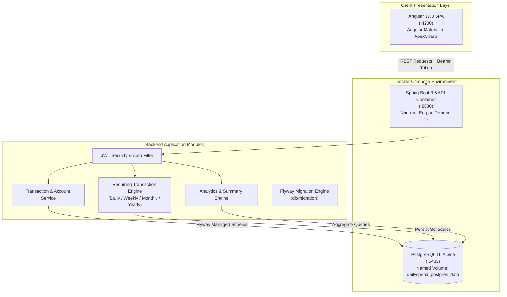

<div align="center">

# DailySpend v2

**Containerized Personal Finance & Peer Debt Orchestrator**

<p align="center">
  <a href="https://adoptium.net/"></a>
  <a href="https://spring.io/projects/spring-boot"></a>
  <a href="https://angular.dev/"></a>
  <a href="https://www.postgresql.org/"></a>
  <a href="https://www.docker.com/"></a>
  <a href="LICENSE"></a>
  <a href="#quickstart"></a>
</p>

<p align="center">
  One command spins up the entire full-stack financial ecosystem.<br>
  Automated recurring expenses · Bidirectional peer debt ledger · Zero manual recalculations.
</p>

<p align="center">
  <a href="#quick-flow">Quick Flow</a> •
  <a href="#system-architecture">Architecture</a> •
  <a href="#core-architectural-modules">Core Modules</a> •
  <a href="#quickstart">Quickstart</a> •
  <a href="#api-contract">API Contract</a>
</p>

</div>

---

> [!NOTE]
> **Evolutionary Project: Built on DailySpend v1**
> This repository is **DailySpend v2**, building directly upon the foundation of **[DailySpend v1](https://github.com/tanmayythakare/dailySpend)**.
> **Key Upgrades in v2**:
> - **1-Command Docker Compose**: Containerized PostgreSQL 16 + multi-stage Spring Boot backend with healthchecks.
> - **Recurring Transactions Engine**: Automated scheduling for daily, weekly, monthly, and yearly recurring expenses.
> - **Deep Analytics Module**: Date-range aggregates, category breakdown summaries, and UPI payment payload helpers.
> - **User Profiles and Batch Processing**: Dedicated user profile settings and batch transaction persistence.

---

## Quick Flow

```
docker compose up  →  JWT Auth  →  Multi-Account Ledger  →  Auto Recurring Engine  →  Live Analytics
```

---

## Visual Showcase

| Dashboard and Accounts | Transactions and Ledger |
| :---: | :---: |
|  |  |
| **People Ledger (Debts and Loans)** | **Reports and Expense Breakdowns** |
|  |  |

> [!TIP]
> **Asset Storage**: System UI captures are organized under [`docs/Screenshots/`](docs/Screenshots/). Dropping new page screenshots into this directory will link directly into the showcase table.

---

## System Architecture



---

## Core Architectural Modules

### 01. Containerized Infrastructure and Concurrency
* **Docker Compose Orchestration**: Single-command startup with dependencies, environment injection, and persistent volume management.
* **Database Healthchecks**: The Spring Boot backend container depends on native PostgreSQL health verification (`pg_isready`) before initiating migrations.
* **Hardened Base Image**: Multi-stage build producing a lean runtime artifact executed by an unprivileged system user (`appuser:appgroup`).
* **Flyway Schema Validation**: Hibernate operates in `validate` mode; all database mutations are tracked through versioned, immutable SQL scripts.

### 02. Peer Debt and Net Settlement Ledger
* **Bidirectional Loan Tracking**: Separates direct outlays from peer transactions (`Money Given` vs `Money Taken`).
* **Real-Time Net Balance Resolution**: Continuously balances debit and credit positions per contact so you immediately know who owes whom.
* **UPI Integration Ready**: Built-in payloads (`UpiQrPayloadDto`) and configurable transaction ceilings (`app.upi.max-collection-amount`) for frictionless instant payments.

### 03. Recurring Transaction Engine
* **Automated Cadence Scheduling**: Configure recurring commitments across `DAILY`, `WEEKLY`, `MONTHLY`, and `YEARLY` intervals.
* **Fixed Obligation Management**: Eliminates manual logging for regular expenses like rent, utilities, and recurring subscriptions.

### 04. Financial Telemetry and Analytics
* **ApexCharts Visual Pipeline**: Live spending velocity, category distributions, and multi-account balance sheets.
* **Date-Range Aggregates**: Parameterized analytics endpoints for month-over-month and custom interval comparisons.
* **Data Portability**: Full CSV export engine for external financial analysis.

---

## Tech Stack

### Backend and Containers
| Technology | Version | Purpose |
| :--- | :--- | :--- |
| **Java** | 17 LTS | Programming language |
| **Spring Boot** | 3.5.x | Application framework and REST controllers |
| **Docker & Docker Compose** | 3.9 spec | Multi-container application orchestration |
| **PostgreSQL** | 16 Alpine | Primary relational datastore with container healthchecks |
| **Spring Security** | 6.x | Stateless JWT security and authorization filters |
| **Spring Data JPA** | 3.x | Hibernate ORM with query specifications |
| **Flyway** | 10.x | Version-controlled immutable database migrations |
| **Eclipse Temurin** | 17 JRE | Secure, minimal non-root container base image |

### Frontend
| Technology | Version | Purpose |
| :--- | :--- | :--- |
| **Angular** | 17.3 | Single Page Application framework |
| **TypeScript** | 5.4 | Type-safe development |
| **Angular Material** | 17.3 | Material Design UI components |
| **ApexCharts** | 3.44 | Interactive data visualizations and dashboards |
| **SCSS** | — | Structured responsive styling |

---

## Quickstart

### 1. Clone the Repository
```bash
git clone https://github.com/tanmayythakare/dailySpend2.git
cd dailySpend2
```

### 2. Configure Environment
```bash
cp .env.example .env
```

### 3. Launch Backend & Database (1-Command Docker)
```bash
docker compose up -d
```
Docker automatically:
1. Boots `postgres:16-alpine` and waits for `pg_isready` healthcheck.
2. Compiles and executes the Spring Boot container via multi-stage Dockerfile.
3. Exposes the backend API on **http://localhost:8080**.

To inspect runtime logs:
```bash
docker compose logs -f backend
```

### 4. Launch Frontend
```bash
cd dailyspend-frontend
npm install
npm start
```
Open **http://localhost:4200** in your browser.

---

### Alternative: Bare-Metal Execution (Without Docker)

If running services directly on your local system:

1. **Create Database**: `CREATE DATABASE dailyspend;`
2. **Configure Local Properties**:
   ```bash
   cd dailyspend-backend
   cp src/main/resources/application-local.yml.example src/main/resources/application-local.yml
   ```
3. **Run Backend**:
   ```bash
   ./mvnw.cmd spring-boot:run -Dspring-boot.run.profiles=local
   ```
4. **Run Frontend**:
   ```bash
   cd ../dailyspend-frontend && npm start
   ```

---

## API Contract

| Method | Endpoint | Description | Auth |
| :--- | :--- | :--- | :---: |
| `POST` | `/api/auth/register` | Register new user account | No |
| `POST` | `/api/auth/login` | Authenticate and obtain JWT token | No |
| `GET` | `/api/v1/accounts` | Fetch user financial accounts | Yes |
| `POST` | `/api/v1/accounts` | Create account (Cash, Bank, Credit) | Yes |
| `POST` | `/api/v1/recurring` | Schedule new recurring transaction | Yes |
| `GET` | `/api/v1/recurring` | List active recurring transaction schedules | Yes |
| `DELETE` | `/api/v1/recurring/{id}` | Cancel recurring transaction schedule | Yes |
| `GET` | `/api/v1/analytics/date-range` | Aggregate spending metrics across custom date window | Yes |
| `GET` | `/api/v1/analytics/categories` | Category distribution and spending velocity summary | Yes |
| `GET` | `/api/v1/people/with-balances` | Retrieve contact ledger with net debit/credit balance | Yes |
| `GET` | `/api/v1/profile` | Retrieve user profile preferences | Yes |

---

## Repository Structure

```
dailySpend2/
├── .env.example                         # Environment configuration template
├── docker-compose.yml                   # Docker orchestration (db + backend)
├── dailyspend-backend/                  # Spring Boot application
│   ├── Dockerfile                       # Multi-stage container build
│   ├── src/main/java/com/example/dailyspend/
│   │   ├── config/                      # Security & JWT configuration
│   │   ├── controller/                  # REST controllers (Analytics, Recurring, etc.)
│   │   ├── dto/                         # Request, Response, and UPI DTOs
│   │   ├── entity/                      # JPA Entities (RecurringTransaction, etc.)
│   │   ├── repository/                  # JPA repositories
│   │   └── service/                     # Business logic services
│   ├── src/main/resources/
│   │   ├── application.yaml             # Core application properties & UPI config
│   │   ├── application-local.yml.example# Local dev configuration template
│   │   └── db/migration/                # Flyway SQL migration scripts
│   └── pom.xml                          # Maven build dependencies
├── dailyspend-frontend/                 # Angular 17 SPA
│   ├── src/app/                         # Core components, feature modules & routing
│   ├── package.json                     # Frontend dependencies
│   └── angular.json                     # Angular CLI configuration
└── docs/
    ├── ARCHITECTURE.md                  # Architectural specification
    ├── RULES.md                         # Engineering guidelines
    └── Screenshots/                     # System UI screenshots
```

---

## Contributing

1. Fork the repository.
2. Clone your fork:
   ```bash
   git clone https://github.com/tanmayythakare/dailySpend2.git
   ```
3. Create your feature branch:
   ```bash
   git checkout -b feat/your-feature-name
   ```
4. Commit your changes:
   ```bash
   git commit -m "feat: add descriptive feature summary"
   ```
5. Push to your branch and submit a Pull Request.

---

## License

This project is licensed under the **[MIT License](LICENSE)**.

---

## Author

**Tanmay Thakare**
* GitHub: [@tanmayythakare](https://github.com/tanmayythakare)
* Email: [tanmayrthakare@gmail.com](mailto:tanmayrthakare@gmail.com)
* LinkedIn: [Tanmay Thakare](https://www.linkedin.com/in/tanmaythakare)

---

<div align="center">
  <a href="https://github.com/tanmayythakare">
    
  </a>
</div>
